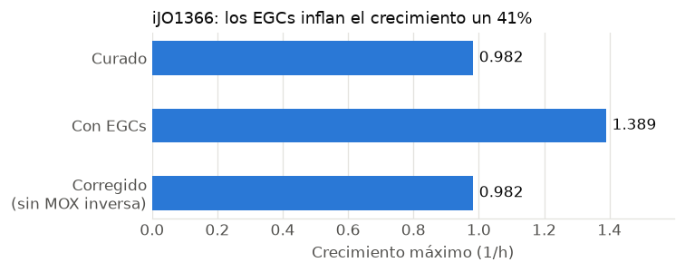

# GlobalFit-EGC

Implementación en Python de **GlobalFit** para detectar y eliminar **ciclos
generadores de energía** (EGCs) en modelos metabólicos a escala genómica,
siguiendo a [Fritzemeier et al. (2017)](https://doi.org/10.1371/journal.pcbi.1005494).
Usa COBRApy y el solver libre HiGHS: no requiere licencias.

## El problema

Un EGC es un conjunto de reacciones que, en un modelo metabólico, carga ATP (u
otro metabolito energético) **sin consumir nutrientes**. Es termodinámicamente
imposible, pero FBA no considera termodinámica: usa esa energía gratis y el
crecimiento predicho se infla. Fritzemeier et al. encontraron EGCs en el 68 % de
350 modelos publicados, y en más del 85 % de los generados automáticamente.



En *E. coli* iJO1366, reactivar las seis reacciones que sus autores bloquearon
crea EGCs que inflan el crecimiento en un 41 %. GlobalFit-EGC encuentra la
corrección mínima (un solo cambio) y devuelve el crecimiento a su valor real.

## Validación contra el paper

La tabla S2 del paper lista qué detectó y qué eliminó GlobalFit en cada modelo.
Resultados de esta implementación sobre modelos descargados hoy de BiGG:

| Modelo | EGCs detectados (normalizado) | Eliminación del paper | GlobalFit-EGC |
|---|---|---|---|
| iND750 (*S. cerevisiae*) | ACCOA 1 — **igual** | `ACOAH` forward | `ACOAH` forward |
| iJN746 (*P. putida*) | ATP 1, CTP 1, GTP 1, UTP 1, ACCOA 1, PROTON 4 — **igual** | `ACALD` forward | `ACALD` forward o `ALDD2x_copy2` backward |
| iJN746, sin tocar la ATP sintasa | | `ALDD2x_copy2` backward | `ALDD2x_copy2` backward o `ACALD` forward |
| iJO1366 + 6 reacciones | ATP, CTP, GTP, UTP, ITP, ACCOA, PROTON | `MOX` backward o `SPODM` forward (Fig. 6C) | `MOX` backward, `SPODM` forward o `MDH` forward |

Cada solución se verifica con un FBA independiente: el modelo corregido no
genera energía sin nutrientes y sigue creciendo. Las corridas toman entre 0,4 y
40 segundos en un portátil; el paper usaba CPLEX en un servidor de 8 núcleos.

Para reproducirlo: `python examples/validate_paper.py`.

## Instalación

```bash
git clone https://github.com/benjamitchell/GlobalFit-EGC.git
cd GlobalFit-EGC
pip install -e ".[dev,demo]"
pytest
```

Requiere Python ≥ 3.10.

## Uso

```python
from globalfit import (
    add_energy_dissipation_reactions, detect_egcs, evidence_weights,
    globalfit, load_bigg_model, verify,
)

model = load_bigg_model("iJO1366")               # descarga de BiGG a ./modelos
edrs = add_energy_dissipation_reactions(model)   # las 15 EDR de la tabla S1

detect_egcs(model, edrs)                          # {"EDR_ATP": 0.0, ...}; > 0 = hay EGC

results = globalfit(
    model,
    energy_rxns=edrs,
    min_growth=0.1,                   # crecimiento mínimo tras corregir
    weights=evidence_weights(model),  # opcional: desempata por evidencia
    protected=["ATPS4rpp"],           # opcional: nunca eliminar estas
    n_solutions=3,                    # enumera alternativas
)
for r in results:
    print(r.objective, [str(x) for x in r.removals])
    energy, growth = verify(model, r.removals, edrs)
```

El notebook [`notebooks/demo_globalfit.ipynb`](notebooks/demo_globalfit.ipynb)
recorre el pipeline completo con resultados.

## Cómo funciona

### Detección

A cada modelo se le agregan **reacciones de disipación de energía** (EDR) para
15 metabolitos energéticos (ATP, CTP, GTP, UTP, ITP, NADH, NADPH, FADH₂, FMNH₂,
ubiquinol-8, menaquinol-8, 2-demetilmenaquinol-8, acetil-CoA, glutamato y el
gradiente de protones), por ejemplo `ATP + H₂O → ADP + Pi + H⁺`. Se bloquea la
captación de nutrientes y se maximiza cada EDR: un flujo positivo indica un EGC.
Las EDR de cofactores redox **no están balanceadas en carga a propósito**: si se
incluyera el aceptor de electrones, la energía podría reciclarse dentro de la
red y la EDR llevaría flujo aunque no hubiera EGCs.

### Corrección: el problema binivel

GlobalFit busca el mínimo de **direcciones** de reacción a eliminar
(binarias $\delta^F_j, \delta^B_j$) que cumplan dos condiciones a la vez:

$$
\begin{aligned}
\min_{\delta}\quad & \textstyle\sum_j w^F_j\,\delta^F_j + w^B_j\,\delta^B_j \\
\text{s.a.}\quad & S\,v = 0,\quad lb_j(1-\delta^B_j) \le v_j \le ub_j(1-\delta^F_j),\quad v_{\text{bio}} \ge T
&& \text{(crecimiento)}\\
& \max_{w}\Big\{\textstyle\sum_{d \in \text{EDR}} w_d \;:\; S\,w = 0,\; l_j(1-\delta^B_j) \le w_j \le u_j(1-\delta^F_j)\Big\} = 0
&& \text{(sin nutrientes, sin EGCs)}
\end{aligned}
$$

La segunda condición es un problema de optimización dentro de otro.

### De binivel a un solo MILP, por dualidad

El problema interno es un LP que siempre admite $w = 0$, así que su óptimo es
$\ge 0$. Por dualidad de LP, el óptimo es $\le 0$ **si y solo si** existe un
certificado dual $(\lambda, \alpha \ge 0, \beta \ge 0)$ con

$$
S^\top \lambda + \alpha - \beta = c, \qquad
\sum_j u_j(1-\delta^F_j)\,\alpha_j + |l_j|(1-\delta^B_j)\,\beta_j = 0,
$$

donde $c$ vale 1 en las EDR y 0 en el resto. Cada término de la suma es no
negativo, así que la suma es cero solo si $\alpha_j = 0$ en toda dirección
forward que sigue permitida (e igual para $\beta$). Eso se linealiza como

$$
\alpha_j \le M\,\delta^F_j, \qquad \beta_j \le M\,\delta^B_j .
$$

El resultado es un único MILP sin variables de flujo para el caso sin
crecimiento, que HiGHS resuelve vía `scipy.optimize.milp`.

**Interpretación.** $\lambda$ funciona como un potencial químico por
metabolito: toda reacción que puede ir hacia adelante debe "bajar" potencial
($S_j^\top\lambda \ge c_j$) y toda la que puede ir hacia atrás, "subirlo". Un EGC
existe exactamente cuando no hay potenciales consistentes con todas las
direcciones permitidas.

**Robustez.** Cualquier solución factible es un certificado válido por
dualidad débil. Un $M$ demasiado chico solo puede dar soluciones con más
cambios de los necesarios, nunca un modelo que siga teniendo EGCs.

### Pesos y alternativas

- `weights` asigna un costo a cada dirección. `evidence_weights` implementa los
  dos criterios que sugiere el paper: eliminar reacciones sin regla génica (GPR)
  es más barato, y eliminar una reacción irreversible completa es más caro que
  eliminar una dirección de una reversible. En iJO1366 esto rompe el empate a
  favor de `MOX`, la única de las tres soluciones sin gen asociado.
- `n_solutions` enumera alternativas con cortes *no-good*. Cada corte prohíbe
  una solución y sus superconjuntos, así que las alternativas salen minimales y
  en orden de costo.

## Diferencias con el paper

| | Fritzemeier et al. (2017) | GlobalFit-EGC |
|---|---|---|
| Lenguaje / solver | R (sybil) + CPLEX | Python (COBRApy) + HiGHS |
| Reformulación binivel | según Hartleb et al. (2016) | dualidad fuerte (ver arriba) |
| Pesos | soportados; se usaron uniformes | uniformes por defecto; `evidence_weights` opcional |
| Namespace de las EDR | BiGG, ModelSEED, MetaNetX | solo BiGG (se pueden pasar otras) |

## Limitaciones

- Las EDR predefinidas usan ids de BiGG. Para ModelSEED o MetaNetX hay que pasar
  un diccionario propio a `add_energy_dissipation_reactions`.
- Del paper se reprodujeron iND750, iJN746 e iJO1366. El tercer modelo de BiGG
  con EGCs, iRC1080 (~50 cambios), no se ha probado.
- `cobra.io.load_model` ya no descarga de BiGG (usa `http://` y el servidor
  redirige a `https://`); por eso el paquete trae `load_bigg_model`.

## Estructura

```
globalfit/            el paquete (core.py: detección, GlobalFit, pesos; io.py: BiGG)
tests/                tests con el modelo core de E. coli y EGCs inyectados
examples/             run_iJO1366.py y validate_paper.py
notebooks/            demo_globalfit.ipynb
  original_2025/      notebooks del proyecto del curso (versión original)
informe/              informe del curso, paper y su material suplementario
docs/                 figuras
```

## Historia

Este repositorio nace del proyecto del curso *Modelamiento y Análisis de Redes
Biológicas* (MA5405, Universidad de Chile, junio 2025). La versión del curso,
en [`notebooks/original_2025/`](notebooks/original_2025/), nunca llegó a una
solución factible por dos motivos: para acelerar las pruebas se trabajó con 12
de las ~2.580 reacciones de iJO1366 manteniendo el balance de masa estricto, lo
que obliga a que la biomasa sea cero; y el problema interno se había planteado
como $\min v_{ATP}$, que vale 0 siempre, en lugar de $\max$. Esta versión
reescribe la implementación desde cero sobre el modelo completo.

## Autores

- **Benjamín Mitchell García**
- **Millaray Díaz Araujo**

Proyecto del curso MA5405, con los profesores Vicente Acuña, Alejandro Maass y
Sebastián Mendoza.

## Licencia

Código bajo licencia [MIT](LICENSE). El paper de Fritzemeier et al. y su
material suplementario en `informe/` se distribuyen bajo CC BY 4.0.

## Referencias

- Fritzemeier CJ, Hartleb D, Szappanos B, Papp B, Lercher MJ (2017). *Erroneous
  energy-generating cycles in published genome scale metabolic networks:
  Identification and removal.* PLoS Comput Biol 13(4): e1005494.
  https://doi.org/10.1371/journal.pcbi.1005494
- Hartleb D, Jarre F, Lercher MJ (2016). *Improved Metabolic Models for E. coli
  and Mycoplasma genitalium from GlobalFit, an Algorithm That Simultaneously
  Matches Growth and Non-Growth Data Sets.* PLoS Comput Biol 12(8): e1005036.
  https://doi.org/10.1371/journal.pcbi.1005036
